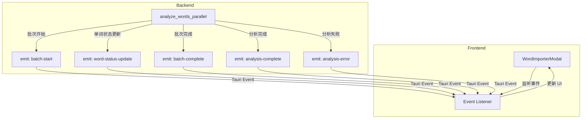

# 批量分析进度更新问题分析与方案设计

## 一、当前问题分析

### 1.1 轮询机制的根本问题

**当前实现**：
```typescript
// 前端每 500ms 轮询一次
const pollInterval = setInterval(async () => {
  const progress = await wordAnalysisService.getBatchAnalysisProgress();
  // 更新 UI
}, 500);
```

**问题诊断**：

1. **时序问题**：后端在异步闭包中更新进度，但前端轮询可能错过中间状态
2. **竞争条件**：多个批次并行执行时，进度更新可能被覆盖或丢失
3. **延迟累积**：轮询间隔 + 网络延迟 + 后端处理延迟，导致 UI 更新滞后
4. **无效请求**：在批次处理期间，轮询可能返回相同的进度，浪费资源

### 1.2 并发批次的进度管理问题

**当前实现**：
```rust
// 在 async move 闭包中更新进度
async move {
    progress_manager.update_word_status(/* ... */);
    progress_manager.update_analysis_progress(/* ... */);
    // 处理批次
}
```

**问题**：
- 5 个并发批次同时更新 `EnhancedProgressManager`
- `Arc<Mutex>` 的锁竞争可能导致更新延迟
- 批次完成顺序不确定，进度计算可能不准确

## 二、事件推送方案设计

### 2.1 架构设计



### 2.2 事件定义

```rust
// 事件类型定义
#[derive(Serialize, Deserialize, Clone)]
pub struct BatchStartEvent {
    pub batch_index: usize,
    pub total_batches: usize,
    pub words: Vec<String>,
}

#[derive(Serialize, Deserialize, Clone)]
pub struct WordStatusUpdateEvent {
    pub word: String,
    pub status: String, // "analyzing", "completed", "failed"
    pub error: Option<String>,
}

#[derive(Serialize, Deserialize, Clone)]
pub struct BatchCompleteEvent {
    pub batch_index: usize,
    pub completed_words: usize,
    pub failed_words: usize,
}

#[derive(Serialize, Deserialize, Clone)]
pub struct AnalysisCompleteEvent {
    pub total_words: usize,
    pub completed_words: usize,
    pub failed_words: usize,
    pub elapsed_seconds: f64,
}
```

### 2.3 后端实现

```rust
// 在 word_analysis_handlers.rs 中
use tauri::Emitter;

async fn analyze_words_parallel(
    ai_service: Arc<AIService>,
    words: Vec<String>,
    app_handle: AppHandle,  // 新增参数
    logger: &Logger,
    progress_manager: &EnhancedProgressManager,
    config: &BatchAnalysisConfig,
) -> Result<BatchAnalysisResult, Box<dyn std::error::Error>> {
    let start_time = std::time::Instant::now();
    
    // ... 批次处理逻辑 ...
    
    let batches_stream = stream::iter(batches.into_iter().enumerate())
        .map(|(batch_index, batch_words)| {
            let ai_service = Arc::clone(&ai_service);
            let logger = logger.clone();
            let batch_index_clone = batch_index;
            let batch_words_clone = batch_words.clone();
            let app_handle = app_handle.clone();  // 克隆 AppHandle
            
            async move {
                // 发送批次开始事件
                let _ = app_handle.emit("batch-start", BatchStartEvent {
                    batch_index: batch_index_clone,
                    total_batches,
                    words: batch_words_clone.clone(),
                });
                
                // 更新单词状态为 analyzing
                for word in &batch_words_clone {
                    let _ = app_handle.emit("word-status-update", WordStatusUpdateEvent {
                        word: word.clone(),
                        status: "analyzing".to_string(),
                        error: None,
                    });
                }
                
                // 处理批次
                match ai_service.analyze_words_batch(
                    batch_words_clone.clone(),
                    batch_index_clone,
                    total_batches,
                    &logger,
                ).await {
                    Ok(batch_results) => {
                        // 发送单词完成事件
                        for word in &batch_results {
                            let _ = app_handle.emit("word-status-update", WordStatusUpdateEvent {
                                word: word.word.clone(),
                                status: "completed".to_string(),
                                error: None,
                            });
                        }
                        
                        // 发送批次完成事件
                        let _ = app_handle.emit("batch-complete", BatchCompleteEvent {
                            batch_index: batch_index_clone,
                            completed_words: batch_results.len(),
                            failed_words: 0,
                        });
                        
                        (batch_index, Some(batch_results), Vec::new())
                    }
                    Err(e) => {
                        // 发送单词失败事件
                        for word in &batch_words_clone {
                            let _ = app_handle.emit("word-status-update", WordStatusUpdateEvent {
                                word: word.clone(),
                                status: "failed".to_string(),
                                error: Some(e.to_string()),
                            });
                        }
                        
                        (batch_index, None, batch_words_clone)
                    }
                }
            }
        })
        .buffer_unordered(config.max_concurrent_batches as usize);
    
    // ... 处理批次流 ...
    
    // 发送分析完成事件
    let _ = app_handle.emit("analysis-complete", AnalysisCompleteEvent {
        total_words: total_words_count,
        completed_words: analysis_results.len(),
        failed_words: failed_words.len(),
        elapsed_seconds: start_time.elapsed().as_secs_f64(),
    });
    
    Ok(result)
}
```

### 2.4 前端实现

```typescript
// 在 WordImporterModal.tsx 中
import { listen, UnlistenFn } from '@tauri-apps/api/event';

const WordImporterModal: React.FC<WordImporterModalProps> = ({
  isOpen,
  onClose,
  onSaveWords,
  saving
}) => {
  const [currentStep, setCurrentStep] = useState<Step>('input');
  const [extractedWordList, setExtractedWordList] = useState<string[]>([]);
  const [wordAnalysisStatuses, setWordAnalysisStatuses] = useState<Record<string, WordAnalysisStatus>>({});
  const [batchProgress, setBatchProgress] = useState<{
    totalWords: number;
    completedWords: number;
    currentBatch: number;
    totalBatches: number;
  } | null>(null);
  
  // 事件监听器引用
  const eventListenersRef = useRef<UnlistenFn[]>([]);
  
  // 设置事件监听
  useEffect(() => {
    if (currentStep === 'batch-analysis') {
      const listeners: UnlistenFn[] = [];
      
      // 监听批次开始事件
      listen('batch-start', (event: any) => {
        const data = event.payload as BatchStartEvent;
        console.log('Batch started:', data);
        setBatchProgress(prev => prev ? {
          ...prev,
          currentBatch: data.batch_index,
          totalBatches: data.total_batches,
        } : null);
      }).then(unlisten => listeners.push(unlisten));
      
      // 监听单词状态更新事件
      listen('word-status-update', (event: any) => {
        const data = event.payload as WordStatusUpdateEvent;
        console.log('Word status updated:', data);
        setWordAnalysisStatuses(prev => ({
          ...prev,
          [data.word]: data.status as WordAnalysisStatus,
        }));
      }).then(unlisten => listeners.push(unlisten));
      
      // 监听批次完成事件
      listen('batch-complete', (event: any) => {
        const data = event.payload as BatchCompleteEvent;
        console.log('Batch completed:', data);
        setBatchProgress(prev => prev ? {
          ...prev,
          completedWords: prev.completedWords + data.completed_words,
        } : null);
      }).then(unlisten => listeners.push(unlisten));
      
      // 监听分析完成事件
      listen('analysis-complete', (event: any) => {
        const data = event.payload as AnalysisCompleteEvent;
        console.log('Analysis completed:', data);
        // 转换结果并跳转到结果步骤
        // ...
      }).then(unlisten => listeners.push(unlisten));
      
      // 监听分析错误事件
      listen('analysis-error', (event: any) => {
        const data = event.payload as { message: string };
        console.error('Analysis error:', data);
        setBatchError(data.message);
      }).then(unlisten => listeners.push(unlisten));
      
      // 保存监听器引用
      eventListenersRef.current = listeners;
    }
    
    // 清理函数
    return () => {
      eventListenersRef.current.forEach(unlisten => unlisten());
      eventListenersRef.current = [];
    };
  }, [currentStep]);
  
  // ... 其他代码 ...
};
```

### 2.5 优势分析

| 方面 | 轮询机制 | 事件推送 |
|------|-----------|---------|
| 实时性 | 500ms 延迟 | 毫秒级延迟 |
| 网络开销 | 持续请求 | 仅事件触发时 |
| 服务器负载 | 持续查询 | 按需推送 |
| 代码复杂度 | 简单 | 中等 |
| 可靠性 | 依赖轮询频率 | 事件驱动，更可靠 |
| 资源消耗 | 高（持续轮询） | 低（按需） |

## 三、批量分析 CSV 格式方案设计

### 3.1 CSV 格式设计

**考虑因素**：
1. 字段可能包含逗号（如中文翻译）
2. 字段可能包含换行符（如分析解释）
3. 需要转义特殊字符
4. 需要保证解析的健壮性

**推荐方案：使用 RFC 4180 标准的 CSV 格式**

```csv
word,chinese_translation,pos_abbreviation,pos_english,pos_chinese,ipa,syllables,phonics_rule,analysis_explanation,frequency
"hello","你好","n.","noun","名词","/həˈloʊ/","hel-lo","元音字母e在闭音节中发schwa音","The letter e in closed syllable makes a schwa sound",5
```

### 3.2 后端提示词修改

```markdown
### 第三步：输出格式
严格按照以下 CSV 格式输出，不要使用 markdown 代码块格式，直接输出纯 CSV 文本：

```
word,chinese_translation,pos_abbreviation,pos_english,pos_chinese,ipa,syllables,phonics_rule,analysis_explanation,frequency
word1,translation1,pos_abbr1,pos_eng1,pos_chi1,ipa1,syllables1,rule1,explanation1,freq1
word2,translation2,pos_abbr2,pos_eng2,pos_chi2,ipa2,syllables2,rule2,explanation2,freq2
```

**重要提示**：
1. 所有字段都必须用双引号包裹
2. 如果字段内容包含双引号，必须用两个双引号转义（例如：`""`）
3. 如果字段内容包含逗号，必须用双引号包裹
4. 如果字段内容包含换行符，必须用双引号包裹
5. 空字段也用双引号表示（例如：`""`）
```

### 3.3 后端解析实现

```rust
use csv::ReaderBuilder;
use std::io::Cursor;

/// 解析 CSV 格式的批量分析响应
fn parse_csv_response(
    &self,
    content: &str,
    logger: &Logger,
) -> Result<Vec<PhonicsWord>, Box<dyn std::error::Error>> {
    // 清理可能的 markdown 代码块格式
    let cleaned_content = self.clean_csv_markdown(content);
    
    // 使用 csv crate 解析
    let cursor = Cursor::new(cleaned_content);
    let mut rdr = ReaderBuilder::new()
        .has_headers(true)  // 第一行是标题
        .flexible(true)       // 允许字段数量不一致
        .from_reader(cursor);
    
    let mut words = Vec::new();
    
    for result in rdr.deserialize() {
        match result {
            Ok(record) => {
                // record 会自动解析为 PhonicsWord（需要实现 Deserialize）
                let word: PhonicsWord = record;
                if !word.word.is_empty() {
                    words.push(word);
                }
            }
            Err(e) => {
                logger.info("AI_SERVICE", &format!("❌ CSV parsing error: {}", e));
                logger.info("AI_SERVICE", &format!("📄 Response content: {}", content));
                return Err(format!("CSV parsing error: {}", e).into());
            }
        }
    }
    
    if words.is_empty() {
        return Err("No valid words found in CSV response".into());
    }
    
    Ok(words)
}
```

### 3.4 依赖添加

需要在 `Cargo.toml` 中添加：

```toml
[dependencies]
csv = "1.3"
```

### 3.5 风险缓解措施

| 风险 | 缓解措施 |
|------|---------|
| 字段包含逗号 | 使用双引号包裹所有字段 |
| 字段包含双引号 | 使用两个双引号转义 |
| 字段包含换行符 | 使用双引号包裹，csv crate 自动处理 |
| 字段缺失或格式错误 | 使用 `flexible(true)` 允许灵活解析 |
| 编码问题 | 确保 UTF-8 编码 |
| 大量数据导致超时 | 使用流式处理，不等待完整响应 |

### 3.6 性能对比

| 方面 | JSON 格式 | CSV 格式 |
|------|-----------|---------|
| 输出大小 | ~500 字节/单词 | ~300 字节/单词 |
| 解析速度 | 中等 | 快 |
| 网络传输 | 较慢 | 较快 |
| 可读性 | 高 | 中 |
| 健壮性 | 高 | 中（需要正确转义） |

## 四、实施建议

### 4.1 优先级

1. **高优先级**：实现事件推送机制（解决进度不更新的根本问题）
2. **中优先级**：批量分析使用 CSV 格式（提高性能）
3. **低优先级**：单词提取使用 CSV 格式（已经实现）

### 4.2 实施步骤

**事件推送**：
1. 定义事件类型结构体
2. 修改 `analyze_words_parallel` 添加 `AppHandle` 参数
3. 在关键节点发送事件
4. 前端添加事件监听器
5. 移除轮询逻辑
6. 测试事件推送的实时性

**CSV 格式**：
1. 添加 `csv` 依赖
2. 修改批量分析提示词为 CSV 格式
3. 实现 CSV 解析逻辑
4. 添加转义和错误处理
5. 测试各种边界情况（特殊字符、空字段等）

### 4.3 兼容性考虑

- 保留 `get_batch_analysis_progress` API 作为备用
- 前端可以同时使用事件推送和轮询（降级方案）
- 如果事件推送失败，自动降级到轮询机制
